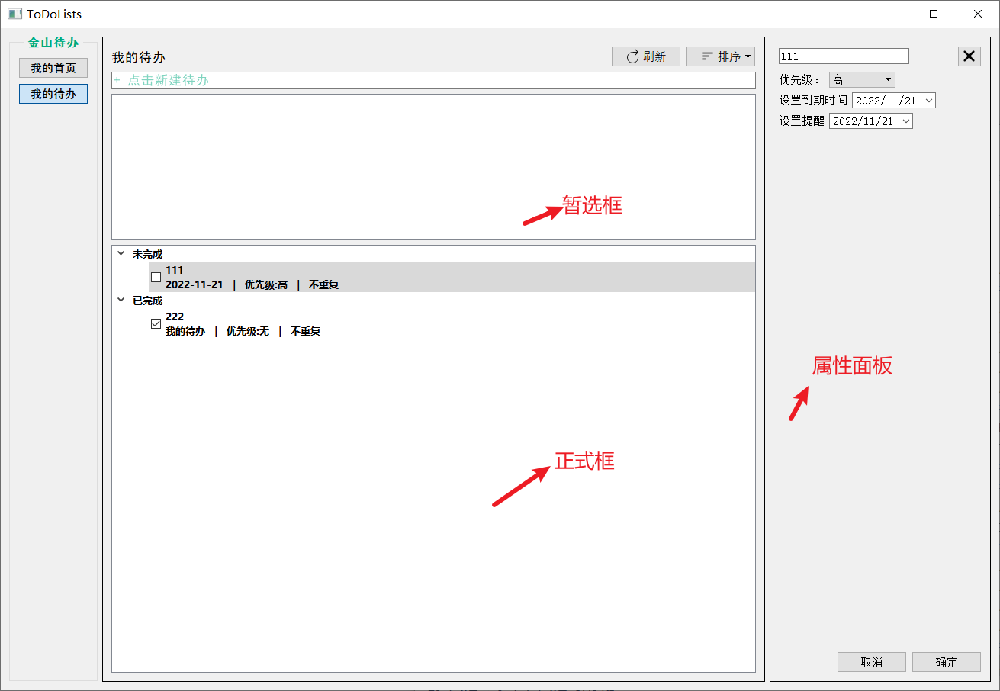

<<<<<<< HEAD

=======

>>>>>>> 6ff565cf8d707243ec416acb98925cdabe2e5b85

功能：

* 插入待办，设置属性，排序

* 上方是暂选框，回车创建待办后需要刷新才能出现在下方，点击表项打开属性面板

* 属性面板编辑属性，点击确定保存，点击取消或者X关闭按钮不会保存

* 可按创建时间，优先级，到期时间排序

Note:

* 暂选框存在表项时不允许打开属性面板。(此时容器没有更新)
